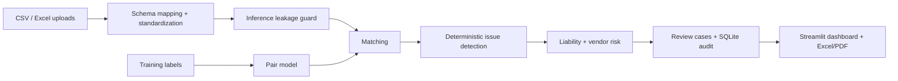

# TaxSentinel

TaxSentinel is a demo-ready GST reconciliation system for tax audit and invoice-to-bank-to-ledger verification.

## Quick start

1. Use Python 3.11 and create a virtual environment: `py -3.11 -m venv .venv`.
2. Activate it in PowerShell: `.\.venv\Scripts\Activate.ps1`.
3. Install dependencies: `python -m pip install -r requirements.txt`.
4. Place `reconciliation_dataset.zip` beside the `taxsentinel` folder. The supplied `files.zip` bundle may contain Test A (`reconciliation_dataset_new.zip`) and the seeded generator; Test B can be read from the original extracted source folder if the original ZIP is not present.
5. Run `python tasks.py data` to generate train seeds 11-13, validation seed 14, and isolated Test A/Test B evaluation inputs.
6. Run `python tasks.py test` to run the tests.

## Commands

| Command | Purpose |
| --- | --- |
| `python tasks.py data` | Generate training/validation data and prepare isolated Test A/Test B evaluation splits. |
| `python tasks.py train` | Train the reconciliation pair model on training seeds only. |
| `python tasks.py eval` | Evaluate validation, Test A and Test B, without training or tuning on either test set. |
| `python tasks.py app` | Start the Streamlit dashboard. |
| `python tasks.py test` | Run pytest. |

## Architecture

## App workflow

- Start with `python tasks.py data`, then `python tasks.py train`, then `python tasks.py app`.
- The landing screen offers an evaluation-only demo or the upload/mapping flow. Upload CSV/Excel data, confirm the fuzzy header suggestions, inspect validation, then reconcile. PDF extraction is opt-in; scanned PDFs additionally require local Tesseract.
- Review cases through Open → Investigating → Explained → Resolved. Comments, reviewer decisions and status actions are stored in local SQLite (`data/review.sqlite`) and appear in the audit view.
- The app provides a read-only whitelist for book queries and in-memory Excel/PDF reports. Tax liability includes a rate what-if and a configured illustrative interest/penalty estimate.
- `python tasks.py eval` writes the full, inference-safe comparison to `eval/results.json`; the Metrics page renders the per-error table, baseline comparison, liability error and validation-only threshold curve. See [`docs/RESULTS.md`](docs/RESULTS.md) for a concise summary and [`docs/DEMO.md`](docs/DEMO.md) for a walkthrough.
- Explanations currently use an offline template. There is no LLM adapter in this release; no numbers or flags are generated by an LLM.
- Vendor risk is computed as `min(100, 100 × severity-weighted issue points ÷ (3 × invoice count))`, with severity weights Critical=4, High=3, Medium=2, Low=1. The UI displays this formula.
- Metrics shown in the dashboard are computed from loaded business records. The app does not show answer-key row counts.

## Data and tax conventions

- Money thresholds and effective tax rates are configured in `config/`; rate verification uses HSN and invoice date.
- The reporting entity is Maharashtra: intra-state supplies use CGST+SGST; inter-state supplies use IGST.
- GSTIN validation requires 15 characters, `Z` in position 14, and a valid checksum. The Test B evaluation reports `wrong_tax_split` and `invalid_gstin` separately because its conventions differ.
- Invoices after 2026-08-25 may legitimately be unpaid. Bulk payments and 2–3-part split payments are valid and reconciled by bounded many-to-many matching.
- Verification against official GST Council/CBIC notifications is required before real-world use. This is not tax advice.

## Dataset handling

- Generated data is split into `data/splits/train/seed-11` through `seed-13`, `data/splits/validation/seed-14`, and `data/evaluation/test_a` / `test_b`. Each has separate `raw/` detector tables and `truth/` labels. Only training truth is eligible for fitting; test labels are reserved for final evaluation.
- If `reconciliation_dataset.zip` is not available, the pipeline requires the previously extracted Test B source at `data/source/gst_reconciliation_dataset`. Test A can be supplied directly as `reconciliation_dataset_new.zip` or nested inside the provided `files.zip`.
- Inference rejects answer-key filenames, challenge/error label columns, and all `linked_*` columns. Evaluation reads held-out labels only after the detector has produced its predictions.

## Limitations

This project is a prototype for the Fintechstico / Consilium'26 challenge and uses synthetic data, not production audit records. Automated feedback-driven retraining, semantic field-difference highlighting, generated journal entries, a Benford baseline for small vendors, and real CA/tax workflows are not implemented. The SQLite audit is append-only through the application API but is not cryptographically tamper-proof. The Streamlit pipeline runs synchronously; large uploaded datasets can temporarily block the app while reconciliation executes. PDF support extracts text only; it does not reliably convert arbitrary tax forms into structured rows. Confirm all source values, rates, eligibility and proposed corrections with a qualified tax professional. Not tax advice.
